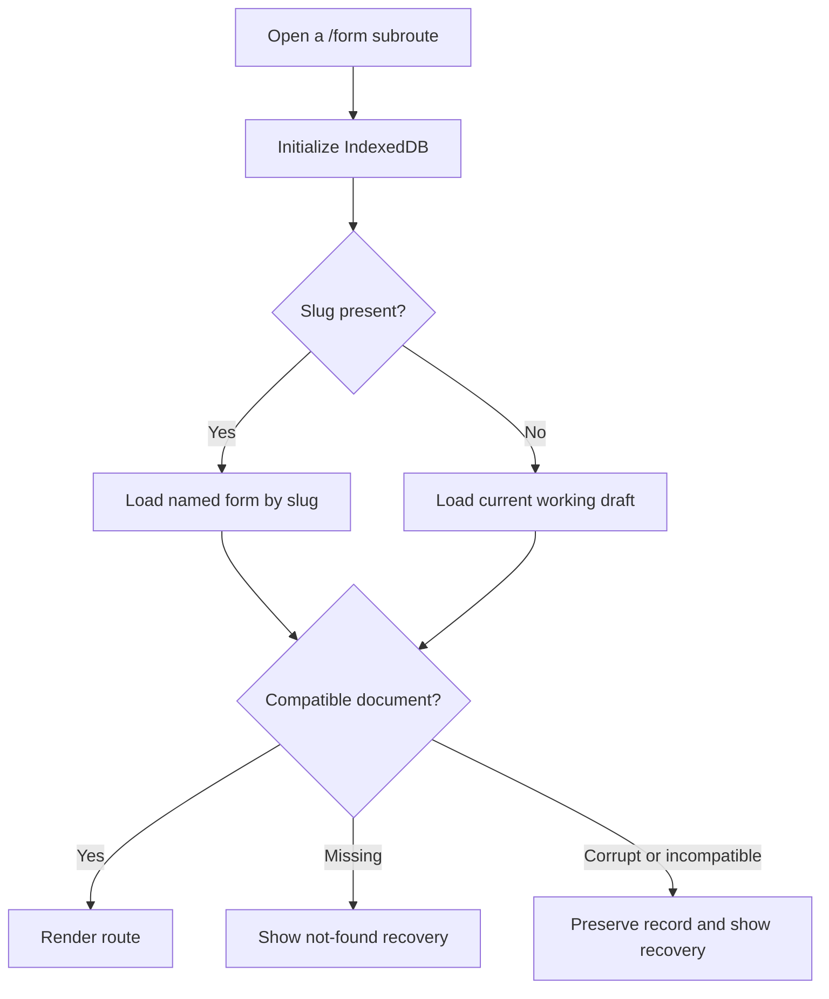
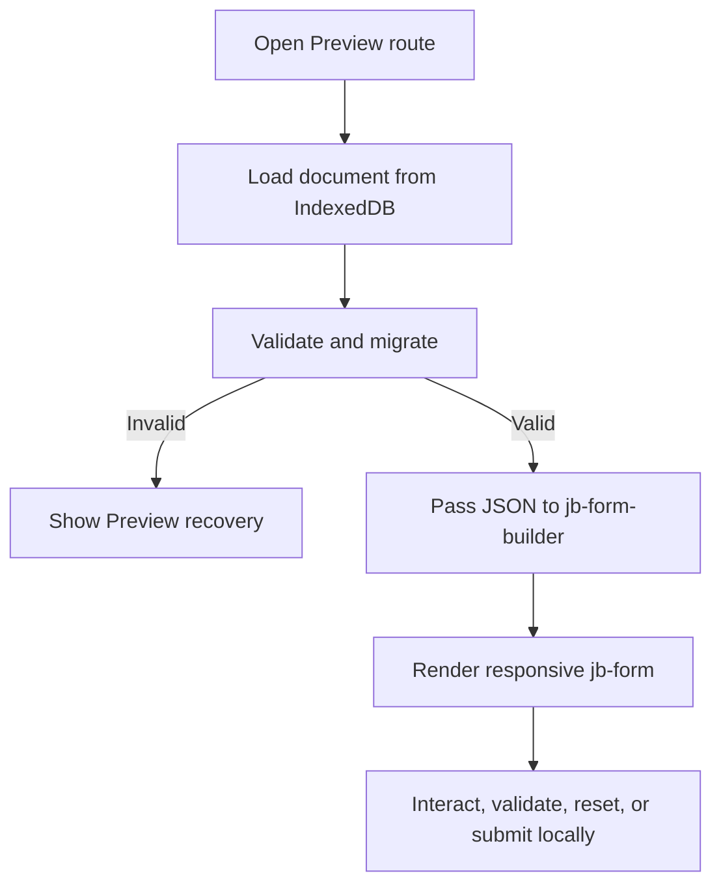

# JB Form — Route-Family Product Flow and Interaction Specification

Status: Approved Phase 1 flow; Phase 2 mobile/touch additions implemented
Phase: Phase 1 — Form Builder  
Route namespace: `/form`  
Reviewed: 2026-07-29

## Purpose

This document defines navigation and interaction across the Phase 1 Form pages. It covers Builder editing, the empty Designer destination, responsive Preview rendering, form resolution from IndexedDB, keyboard and focus behavior, locale/direction behavior, persistence feedback, and recovery.

It does not define the final JSON schema, Theme Designer UI, state-management implementation, or visual theme. Mobile/touch Builder behavior is now included in the implementation and acceptance notes.

## Confirmed product constraints

- `/form` is the route namespace.
- `/form` has its own landing page.
- Builder, Designer, and Preview are separate routes.
- Each route accepts an optional form slug.
- When a slug is present, the page loads that named form by default.
- When no slug is present, the page loads the current working draft.
- Builder contains links to Designer and Preview for the current form.
- Designer is an identity-preserving placeholder and is implemented after the higher-priority workflow expansion.
- Builder has no embedded Preview mode.
- Preview is a separate responsive page.
- Preview loads its form JSON from IndexedDB and passes it to `<jb-form-builder>`.
- `<jb-form-builder>` receives portable form JSON and renders the runtime `jb-form`.
- English and LTR are the defaults.
- Locale configuration and translation use `jb-core/i18n`.
- Every generated form element has a non-empty `name` attribute.
- Element names are non-empty. Duplicate names are allowed because `jb-form` intentionally collects controls sharing a name into an array.
- Catalog and element-list entries use proper semantic icons, not emoji or text-symbol substitutes.
- Styling uses CSS Modules and external pure CSS. CSS-in-JS is prohibited.
- Application color tokens use OKLCH.
- App-owned rounded surfaces use `corner-shape: squircle` with their existing `border-radius` as the unsupported-browser fallback.
- Authored layout and spacing dimensions use `rem`.
- Component-owned UI state uses local React state; state shared across Builder regions uses MobX.
- Builder is desktop-first at wide widths and supports the Phase 2 compact/mobile workspace; Preview is responsive at all supported widths.

## Route contract

| Purpose | Without slug | With slug |
| --- | --- | --- |
| Landing | `/form` | N/A |
| Builder | `/form/builder` | `/form/builder/:slug` |
| Designer | `/form/designer` | `/form/designer/:slug` |
| Preview | `/form/preview` | `/form/preview/:slug` |

The slug is an optional final path segment, not a query parameter.

### Landing page

`/form` is the entry and form-selection surface. It provides:

- Continue current draft when one exists.
- Create new form.
- Open a named form in Builder.
- Open a named form directly in Designer or Preview.
- Clear empty, unavailable-storage, incompatible-record, and no-saved-forms states.

Creating a new form while the current draft contains work uses the approved Save, Continue without saving, or Cancel decision pattern. The landing page uses `jb-core/i18n`, defaults to English/LTR, and supports Persian/RTL.

### Form resolution

Every route uses the same resolution contract:

1. Initialize IndexedDB.
2. If a slug is present, resolve the compatible named-form record for that slug.
3. If no slug is present, resolve the current working draft.
4. Validate and migrate the stored record before use.
5. If the record does not exist or cannot be opened safely, show the route-specific recovery state.

The route must not silently fall back from an invalid or unknown slug to another form. That would make the URL misleading.

## Shared form context

The three routes share these concepts:

| Term | Meaning |
| --- | --- |
| Working draft | The current editor document. Its last explicitly saved snapshot is stored in IndexedDB and used by no-slug routes. |
| Named form | An explicitly saved snapshot with stable ID, unique slug, display name, and timestamps. |
| Linked named form | The named form from which the working draft was loaded or most recently saved. |
| Named-form changes | Differences between the in-memory working document and its last explicitly saved snapshot. |
| Builder locale | Editor UI locale managed through `jb-core/i18n`; editor-only state. |
| Form default locale | Portable form configuration. Defaults to English. |
| Form direction | Portable form configuration. Defaults to LTR. |

## Builder page

### Persistent header

The Builder header contains, in logical order:

1. Product identity.
2. Current form name or `Untitled form`.
3. Settings button beside the form name.
4. Form identity state:
   - `Current draft`;
   - `Linked to {form name}`.
5. Save state:
   - `Unsaved changes`;
   - `Saving…`;
   - `Saved`;
   - `Save failed`.
6. Explicit `Save` action.
7. Builder-locale selector.
8. `Designer` navigation button.
9. `Preview` navigation button.
10. `Export JSON`.

Designer and Preview are navigation actions, not mode toggles.

The identity label and Save state remain separate: identity explains which record is linked, while Save state reports whether the current in-memory document matches its last explicit snapshot.

### Workspace regions

| Region | Position | Responsibility |
| --- | --- | --- |
| Component catalog | Inline start | Search, categories, semantic component icons, descriptions, and Add actions. |
| Form canvas | Center | Ordered single-column form structure, selection, and element actions. |
| Configuration panel | Inline end | Editable configuration for the selected element. |

In RTL, inline start is the right side and inline end is the left. Vertical form order never reverses.

### Desktop layout

| Width | Behavior |
| --- | --- |
| `90rem` and wider | Catalog, canvas, and configuration panel remain visible. |
| `75rem`–`89.9375rem` | All three regions remain visible with compact side panels. |
| `64rem`–`74.9375rem` | Canvas remains primary; only one side panel is expanded at a time. |
| Below `64rem` | Phase 2 mobile workspace shows one of Catalog, Canvas, or Properties at a time. Preview remains available. |

All implementation dimensions use `rem`. A one-device-pixel border may use the design-system token or the smallest appropriate CSS border value when a `rem` conversion would create inconsistent rendering.

### Direct entry

- `/form/builder` restores the current draft or creates a new empty draft.
- `/form/builder/:slug` loads the named form and establishes it as the working draft and linked named form.
- The builder never opens with a project selector.
- Storage initialization completes before choosing empty versus restored state.
- Default new-form configuration is locale `en` and direction `ltr`.

## Component catalog

### Icons

- Every catalog item and canvas element summary has a component-specific icon, reusing a suitable JB asset or using a locally designed catalog SVG.
- Icons communicate component type; they do not replace the visible component name.
- Icons have accessible treatment appropriate to whether they are decorative or meaningful.
- No emoji, Unicode text symbol, third-party icon package, or CSS-drawn approximation is used.
- The component registry owns the icon mapping so Builder and future Designer surfaces stay consistent.
- When no appropriate JB icon exists, create a repository-owned SVG using the shared `24 × 24` view box, `currentColor`, consistent stroke/fill treatment, and accessible decorative handling beside visible text.

### Browsing and adding

- Search covers display name, tag name, category, and keywords.
- Categories remain visible when search is empty.
- Each item has a visible `Add` button.
- Activating Add appends a valid default element.
- Desktop pointer drag may insert at a visible canvas insertion point.
- Keyboard Add keeps focus on the Add button and announces the inserted component and position.
- Pointer drag focuses the inserted element after drop.

Adding:

- creates a stable element ID;
- generates a non-empty default `name`;
- selects the element;
- scrolls it into view;
- updates the configuration panel;
- marks the in-memory document unsaved without writing IndexedDB;
- marks the linked named form as changed.

## Form-element naming contract

- Every generated catalog element, including action elements such as `jb-button`, has a non-empty `name` attribute.
- Add generates a valid name from the component type.
- Duplicate generates a new element ID and preserves the name by default so repeated values can be grouped.
- The configuration panel treats name as a required property.
- Clearing name produces an inline error.
- Preview and JSON export are blocked while any element lacks a valid name.
- Names may repeat across the form. The JSON contract defines allowed characters, normalization, and maximum length.

## Canvas editing

### Element card

Every form element has:

- a focusable selection surface;
- semantic component icon;
- component name and accessible position;
- drag handle;
- Move up and Move down;
- Duplicate;
- Remove;
- a non-interactive rendering of the configured JB component.

The rendered form control does not receive pointer or keyboard interaction in Builder. Selecting its editor card updates the configuration panel.

To keep the 100-element editing baseline responsive, the full JB action toolbar is mounted only for the selected card. Every card keeps its lightweight selection surface and keyboard navigation, and selecting a card reveals Configure, Move, Duplicate, Remove, and drag-handle actions without changing document data.

### Selection and configuration

- Pointer tap/click, `Enter`, or `Space` selects a focused card.
- `ArrowUp` and `ArrowDown` move card focus.
- Selection does not automatically move focus into configuration.
- On mobile, Add selects the new element and returns from Components to Form canvas.
- A visible Configure action opens the mobile Properties panel when needed and then focuses the first configuration control.
- The configuration panel exposes only supported JB properties.
- Invalid configuration is explained inline and summarized before Preview or export navigation.

### Reordering

- Pointer users drag by the handle and see an insertion indicator.
- Coarse-pointer users do not receive the drag handle; they reorder through the selected card's explicit Move up and Move down controls.
- `Escape` cancels active dragging.
- Keyboard users have Move up and Move down buttons.
- `Alt+ArrowUp` and `Alt+ArrowDown` are equivalent shortcuts while a card owns focus.
- Focus and selection remain on the moved element.
- New position is announced.

### Duplicate

Duplicate inserts immediately after the source:

- configuration is copied;
- stable element ID is regenerated;
- `name` is preserved so repeated values can remain intentionally grouped;
- Preview response data and validation display state are not copied;
- the duplicate becomes selected and focused.

### Remove

Removal keeps an explicit confirmation step. A confirmed removal can be restored with Undo.

After confirmation:

- focus moves to the next element, previous element, or empty heading;
- the configuration panel follows the new selection;
- the Builder marks the document unsaved without writing IndexedDB;
- the named form becomes changed.

Cancel returns focus to Remove.

## Configuration behavior

- Valid configuration updates the canvas immediately.
- Invalid intermediate values remain in their controls with inline errors.
- Users may navigate to another element while configuration is invalid.
- The canvas isolates component render failures to the affected card.
- Designer, Preview, and export navigation validate the document before continuing.
- An error summary links to the affected card and control.
- Every committed change marks the document unsaved; persistence occurs only through explicit Save or Save As.

## Designer navigation and placeholder

Designer is a separate destination:

- `/form/designer` resolves the working draft.
- `/form/designer/:slug` resolves the named form.
- Builder has a visible Designer button with an appropriate icon.
- Before navigation, Builder requires the changed document to validate and save successfully.
- Phase 1 Designer shows an intentional empty/not-yet-available page with:
  - resolved form identity;
  - a clear future-work message;
  - Back to Builder;
  - Open Preview.
- Designer does not alter form JSON in Phase 1.

The empty Designer page is not a fake theme editor.

## Preview page

### Loading contract

Preview never depends on in-memory Builder state because it is a separate page.

1. Open `/form/preview` or `/form/preview/:slug`.
2. Initialize IndexedDB.
3. Resolve the working draft or named form using the shared route contract.
4. Validate and migrate the stored form document.
5. Pass the portable JSON document to `<jb-form-builder>`.
6. `<jb-form-builder>` renders the runtime form and applies locale, direction, initial values, options, and declarative validation rules.

### Renderer responsibility

The application-local test `<jb-form-builder>`:

- accepts the complete portable form JSON through a documented JavaScript property;
- renders the ordered form elements;
- applies required `name` attributes;
- creates runtime `jb-validation` rules from declarative JSON;
- applies default locale and direction;
- initializes values from form configuration;
- exposes loading, ready, invalid-document, component-error, reset, and validation-result states;
- never writes runtime response values back into the form definition;
- does not own IndexedDB lookup or route resolution.

This application renderer remains in use through Phase 2 implementation. It will be converted into and consumed from a published JB Design System package only at the owner-approved final delivery step.

The Preview page owns IndexedDB and supplies JSON to the renderer.

### Responsive behavior

- Preview supports narrow mobile through wide desktop viewports in Phase 1.
- Phase 2 Builder editing uses a single visible workspace panel below `64rem`, with persistent Components, Form canvas, and Properties navigation. The form canvas is the initial mobile panel.
- Mobile header actions remain in document order and scroll horizontally when they do not fit; no action is removed from the narrow layout.
- The generated single-column form uses available inline size without horizontal page scrolling.
- Controls remain usable at 200% zoom.
- Preview applies the loaded form locale/direction to the client-side page and renderer in Phase 1.
- Preview navigation and recovery controls remain accessible on small screens.
- Touch Builder selection uses the card surface, Add and Configure advance to the relevant mobile panel, and ordering uses explicit Move controls. HTML drag-and-drop remains a fine-pointer enhancement.
- Primary coarse-pointer actions use a minimum `2.75rem` (`44px` at the default root size) target.
- Layout values use `rem`, logical properties, and JB design tokens.

### Runtime values

- A Preview session begins from configured initial values.
- Reset restores configured initial values.
- Form submission runs native and JB validation but sends no backend request.
- Runtime response values are session-only.
- Reloading Preview reloads form JSON from IndexedDB.

## Builder-to-Designer and Builder-to-Preview navigation

Before navigation:

1. Commit valid pending configuration edits.
2. Validate the portable document.
3. If the document is dirty, require an explicit Save.
4. If Save fails or is canceled, remain in Builder and offer Retry or Export; do not open a destination that would load stale JSON.
5. Navigate only after the destination can resolve the intended stored record.

For a linked named form with changes, Designer and Preview require explicit Save before navigation and then open the slug route. They never preview an older named snapshot while presenting it as the current form.

An unnamed working draft may use a no-slug Designer or Preview route only after an explicit current-draft Save succeeds.

## Form management

The settings button opens `jb-modal`.

### Current form

The modal contains:

- form name;
- slug or slug preview;
- default locale, initially English;
- direction, initially LTR;
- linked named-form state;
- Save;
- Save As.

Save behavior:

- unnamed draft: Save persists the singleton current-draft snapshot;
- unnamed draft with a supplied name/slug: the same Save transaction also creates a named record;
- linked form: Save explicitly replaces the named snapshot;
- Builder Save As: creates a new IndexedDB form ID and slug while preserving copied element IDs;
- Export/download another file: preserves the portable document ID and element IDs;
- all IndexedDB writes require explicit Save or Save As;
- successful named Save clears named-form changed state;
- failure preserves modal values and offers Retry.

### Loading

Named forms are ordered by most recently updated. Each shows name, slug, update time, element count, compatibility, and Load.

Loading over changed or unnamed work proposes:

- Save current work;
- Load without saving;
- Cancel.

Deleting named forms is available from the landing page with confirmation.

## Locale and direction

### Builder UI

- Use `jb-core/i18n` as the only locale dictionary/configuration mechanism.
- Default builder locale is English.
- Default builder direction is LTR.
- Persian/RTL remains supported in Phase 1.
- Builder locale is editor-only state and does not alter form content.
- Locale preference is restored independently from the form document.

### Form runtime

- Default form locale is English.
- Default form direction is LTR.
- Form locale and direction are portable form configuration.
- Preview applies form locale/direction through `<jb-form-builder>`.
- Localizable values retain a Phase 1 structure that can add locale variants in Phase 2.
- Exact locale identifiers, fallback, and schema representation are defined in the JSON-contract step.

## Styling and state constraints

### Styling

- Use CSS Modules for React application-shell layout and component styling.
- Use external pure CSS for component Shadow DOM styles and design-system integration.
- Do not use CSS-in-JS, runtime-generated style objects, or component-scoped JavaScript styling.
- Use `rem` for authored spacing, sizing, typography, breakpoints, and layout dimensions.
- Use CSS logical properties for direction-aware layout.
- Consume JB design tokens and styling hooks rather than copying component CSS.
- Style exposed JB control parts with `::part` selectors when a component surface needs the app's squircle treatment; do not add a shared corner-shape variable or pierce private Shadow DOM.

### State management

- Use `useState`/`useReducer` for state owned by one component or tightly contained subtree.
- Use MobX only for state observed or changed by independent Builder regions.
- Keep ephemeral state such as a local disclosure, hover, temporary input presentation, or isolated loading indicator out of MobX.
- Portable form JSON, route/load state, editor-only state, and Preview runtime response state remain separate regardless of whether MobX is used.

### Performance and memoization

- The reference form contains 100 elements.
- Editing actions provide visible feedback within `100 ms`.
- Restore/export complete within `1 second`; Preview reaches renderer-ready within `1.5 seconds`.
- Canvas cards subscribe only to their own element and necessary shared selection/order state.
- Catalog filtering, canvas updates, and configuration commits do not rerender unrelated regions.
- Use stable element IDs as keys.
- Use `observer`, `React.memo`, `useMemo`, and `useCallback` only at measured boundaries with stable inputs.
- Keep local UI state local so isolated interactions do not invalidate MobX observers.
- Full-document cloning, serialization, and validation do not run on every keystroke.
- Lazy-load component packages and clean up listeners/reactions on unmount.

## Save-state model

### Working draft

| State | Treatment | Recovery |
| --- | --- | --- |
| Initializing | Loading status while IndexedDB resolves | Retry |
| Clean | `Saved` | None |
| Dirty | `Unsaved changes` | Save or export |
| Saving | `Saving…` | Continue editing; serialize one save transaction |
| Failed | Persistent `Save failed` | Retry, continue in memory, export |

### Named form

| State | Treatment | Meaning |
| --- | --- | --- |
| Unnamed | `Not saved as a named form` | Only working draft exists |
| Linked clean | `Saved to named form` | Draft matches snapshot |
| Linked changed | `Changes not saved to named form` | Draft is newer than named snapshot |
| Saving | Save loading state | Explicit save is running |
| Failed | Inline modal error | Snapshot was not replaced |

## Error and recovery

| State | Builder | Designer | Preview |
| --- | --- | --- | --- |
| Unknown slug | Not-found with Open current draft | Not-found with Back to Builder | Not-found with Open current draft |
| IndexedDB unavailable | Continue in memory; Export remains | Cannot resolve form; Back | Cannot resolve form; Retry |
| Quota exceeded | Stop claiming saved; Retry/Export | Existing records remain readable where possible | Existing records remain readable where possible |
| Corrupt record | Preserve raw record; recovery actions | Do not render placeholder as valid | Do not pass JSON to renderer |
| Newer schema | Read-only recovery/export | Compatibility message | Compatibility message |
| Invalid names/config | Inline and summary; block navigation/export | N/A | Do not render invalid document |
| Renderer element failure | Builder card fallback | N/A | `<jb-form-builder>` isolates and reports affected element |

## Keyboard and focus contract

| Input/action | Result |
| --- | --- |
| `Tab` / `Shift+Tab` | Follow visible controls in semantic DOM order |
| `Ctrl+S` / `Cmd+S` | Explicitly save the current draft; named linked forms update their named snapshot in the same transaction |
| `Escape` | Close topmost modal/popover or cancel drag |
| Add | Keep focus on Add and announce insertion |
| Move | Keep focus on moved card and announce position |
| Duplicate | Focus duplicate |
| Remove cancel | Return to Remove |
| Remove confirm | Focus next, previous, or empty heading |
| Designer/Preview navigation failure | Return focus to initiating button or error summary |
| Modal close | Return to settings button |

Browser-reserved shortcuts are not overridden.

## Accessibility

- Every icon-only control has an accessible name and tooltip where useful.
- Catalog icons are paired with visible names.
- Drag is never the only add or reorder method.
- Edit-mode component renderings cannot accidentally receive focus.
- Errors link to their element and configuration control.
- Save and route-loading states are announced without relying on color.
- Preview preserves the underlying JB controls' keyboard and validation behavior.
- Builder LTR/RTL visual order and DOM focus order are tested together.
- Responsive Preview is tested with keyboard, touch, screen reader semantics, zoom, and both directions.
- Mobile Builder verification covers 320px, 375px, and 768px live layouts, the shared 412px breakpoint behavior, panel focus transitions, 44px touch targets, saved-draft restoration, import boundaries, and export presentation.

## JB Design System usage

| Need | JB component/module |
| --- | --- |
| Actions and route links | `jb-button` |
| Catalog search | `jb-searchbar` |
| Text configuration | `jb-input` and specialized controls |
| Enumerated configuration | `jb-select` |
| Form management and confirmation | `jb-modal` |
| Transient feedback | `jb-notification` |
| Loading | `jb-loading` |
| Contextual help | Visible help text or accessible description; no tooltip package required |
| Catalog and action icons | Registry-owned repository SVG assets |
| Locale configuration | `jb-core/i18n` |
| Preview rendering | `<jb-form-builder>` |

Before implementation, inventory the exact icon for each catalog component. Reuse suitable JB assets first; otherwise design the missing icon locally and keep the mapping in the component registry.

## Core acceptance journeys

### New draft

1. Open `/form/builder`.
2. Restore or create the current draft.
3. Confirm English/LTR defaults.
4. Add elements with generated names and icons.
5. Configure, reorder, duplicate, and save the draft.
6. Refresh and restore.

### Slug entry

1. Open `/form/builder/:slug`.
2. Resolve the named form from IndexedDB.
3. Establish it as linked working draft.
4. Change it and observe separate draft/named save states.

### Separate Preview

1. Change a valid draft.
2. Activate Preview.
3. Complete an explicit Save before navigation.
4. Preview reloads JSON independently.
5. `<jb-form-builder>` renders the responsive form.
6. Interact, validate, reset, and reload without changing form configuration.

### Designer placeholder

1. Activate Designer for the current form.
2. Resolve the same form identity.
3. Show the future-work placeholder.
4. Return to the correct Builder route or open Preview.

### Persian/RTL form

1. Keep Builder in English/LTR.
2. Configure the form as Persian/RTL.
3. Open Preview after Save.
4. The client-only Preview page and renderer apply Persian/RTL through `jb-core/i18n`.

### Persistence failure before navigation

1. Change the draft.
2. Make IndexedDB persistence fail.
3. Activate Designer or Preview.
4. Remain in Builder with Retry/Export.
5. Do not show stale JSON on the destination page.

## Approved interaction decisions

- `/form` is a landing page.
- Builder editing is supported from `320px` through desktop widths. Below `64rem`, the workspace shows one panel at a time; Preview remains responsive.
- Add supports a button and desktop drag-to-insert.
- Every removal requires confirmation in Phase 1.
- Loading over changed work offers Save, Continue without saving, or Cancel.
- Save As is included, and named-form deletion is available from the landing page with confirmation.
- Preview begins from configured initial values and keeps response values session-only.
- Every element name is non-empty and valid; repeated names produce intentional array values.
- Changed linked forms require explicit Save before Designer or Preview navigation.
- The application `<jb-form-builder>` renderer is used through Phase 2; publication remains the owner-approved final delivery step.
